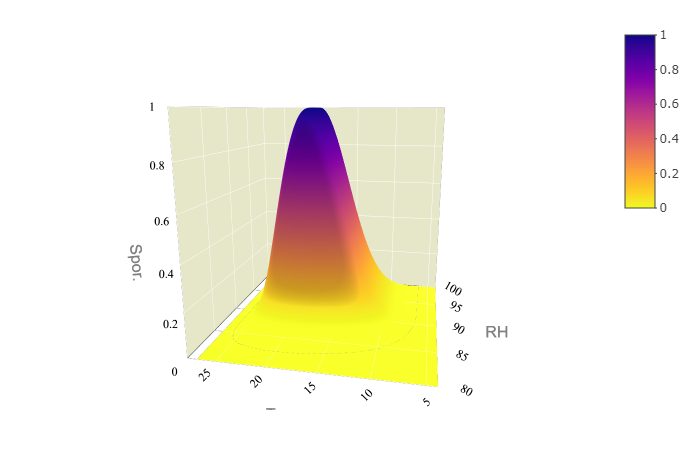
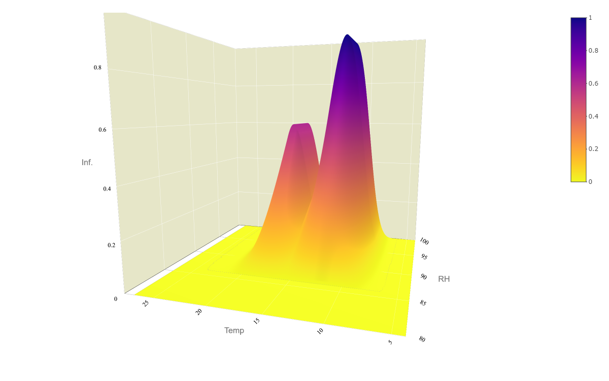

```{r setup, include=FALSE}
knitr::opts_chunk$set(echo = FALSE)
```

```{r pkg, warning=FALSE, message=FALSE}
source(here::here("scr","lib", "pkg.R"))

```
## The Model 

### Sporulation
Ther eis a fair reason to believe that the sporlation is mostly local, and that the spore survival reduces according to power law function 

The reason for not having a fixed threshold for estimation of leaf wetness using rh is the same as for having the sporulation segment in the first place. 
Also this is a regional model. No real data on leaf wetness estimationband the analysis have shown that setting the threshold too low is bringing in question the usefulness of the model. so we will use the adapted threshold.... When the rh is above 95 at the station provides more certain reason to estimate that risk of the host plant surface is wet and susceptible to infection. 
Use michelaidis and nestad write-up of the model
Read the model by Israeli people
The model is based on estimation of three segments of the life cycle: 
 - Sporulation risk  
 - Survial of inoculum and  
 - Infection risk  
 Potato late blight risk is the calculated based on cumulatiove daily estiations of risk.
To accomodate the simplicity

Sporulation is occuring and whether those spores that are produced will be dispersed in the air and we want to know if those sporangia are transported viable or are killed during transport. Solar radiation is lethal to sporangia and most that are in the air will be killed by the sunlight before they reach another location, and subsequentially, how long they might survive on foliage in that location. We do know that on sunny days they don't survive as well as they do on cloudy days so conceptually we know that the very worst conditions for dispersal ae a sunny morning so that does enhanced release becomes cloudy fairly quickly and midday and that will enhance survival of spores. Wet leaves at night are enabling germination and infection to occur during the night. These factors are put together into an algorithm which includes the amount of sporulation, the survival of this branch and the likelihood that germination will occur on the succeeding evening.This algorithm then provides a Risk estimation. 

The risk of spurulation and infection is calculated as a function of temperature and relative humidity, where relative humidity is an estimator of surface wetness. The impact of temperature on sporulation and infection risk was modeled using five parameter beta function, after Yan and Hunt (1996).
To parameterize the model, cardinal (minimum (Tmin), maximum (Tmax) and optimal (Topt)) temperatures (CT) for were extracted from the literature.  Crosier (1934) found that no sporangia was formed outside the range 3-26°C while the optimum was considered to be between 18 and 22°C. The shape factor was calculated 

 Rao et al. (1998) showed that LWD estimation on a maze ear was less accurate with
weather data measured nearby weather station than near the top of the maze canopy. When
estimated weather data are used as input data of an energy balance model, it is considerably
difficult for energy balance models to correctly identify wetness occurrence. 


```{r import_data_harrison}
spor_df <- read_excel(here::here("dat", "Harrison data.xlsx"))

names(spor_df)[1] <- "rh"
spor_df <-  gather(spor_df, "wind", "spor", -rh)
spor_df$spor <-  as.numeric(spor_df$spor)
spor_df$wind <-  as.numeric(spor_df$wind)
# spor_df$wind <-  factor(spor_df$wind, levels = c("0.3", "1.4", "5.5", "13.7"))
ggplot(spor_df, aes(factor(spor_df$wind, levels = c("0.3", "1.4", "5.5", "13.7")), rh))+
  geom_tile(aes(fill = spor))+
  xlab("Wind (m/s)")+
  scale_fill_gradient(low = "lightgray", high = "black")

spor_df <-  spor_df[spor_df$wind == 1.4 ,] %>% arrange(., rh)
```
  
  *!!The rate parameter is not good here and this needs refitting*

```{r fit_logistic}
start_Ks <- c(110) #the population size at equilibrium
start_n0 <- c(0.001) #the population size at the begining
start_r<- c(0.15) #the growth rate
rh <- spor_df$rh - 80
spor <-  spor_df$spor 

#Use minpack.lm function because nls apparently has a famouse "singular gradient issue"
  f <- spor~K*n0*exp(r*rh)/(K+n0*(exp(r*rh)-1))
m <-
  minpack.lm::nlsLM(
    formula = f,
    start = list(K = start_Ks, n0 = start_n0, r = start_r),
    control = nls.lm.control(maxiter = 500)
    )
m
 
  
fit_data <- broom::augment(m)
fit_data[, c("spor", ".fitted")]
  
# return rh data to approprate scale
fit_data[, "rh"] <- fit_data[, "rh"] + 80

# Change to a resizing factor, as a proportion
fit_data[, c(".fitted", "spor")] <- lapply(fit_data[, c(".fitted", "spor")], function(x) x/max(x))

#do the same stpes with the predicted data
newdata <- data.frame( rhvec = seq(0, 20, 0.1))
newdata$fit <- predict(m, newdata=data.frame( rh =newdata$rhvec ), interval =  "prediction")
newdata$rhvec <- newdata$rhvec+80

newdata[, "fit"] <- newdata[, "fit"] / max(newdata[, "fit"])

#Save the coefficents
KSpor <- coef(m)["K"]
n0Spor <- coef(m)["n0"]
rSpor <- coef(m)["r"]
KSpor <- 97049.81
n0Spor <- 0.0006048922
rSpor <- 1.734924

newdata$rhvec <- ifelse(newdata$rhvec >=80, newdata$rhvec - 80, 0)
sporulation_rh <-
  sapply(newdata$rhvec, function(x) {
    spor_rh_hour <-
      KSpor * n0Spor * exp(rSpor * x) / (KSpor + n0Spor * (exp(rSpor * x) - 1))
    # Change to proportion; sporulation is divided by sporulation at the equilibrium
    spor_rh_hour <- as.numeric(spor_rh_hour) / as.numeric(KSpor)
    return(spor_rh_hour)
  })

sporulation_rh

ggplot() +
  geom_line(data =newdata, aes(newdata$rhvec+80, sporulation_rh,color = "Fitted"), size = 0.8) + 
  geom_point(data = fit_data, aes(rh, spor,color = "Observed")) +
  scale_color_manual(values = c("Fitted" = "gray",
                                "Observed" = "black"))+
  labs(y = "Sporulation Proportion", x = "RH (%)", colour = "Data")+
  egg::theme_article()
```
  
Temperature relation to sporulation.  
  
```{r}

temp <- c(4:28)

TminSpor <- 6
ToptSpor <- 20
TmaxSpor <- 26
RfactSpor <- 1 #set to default 1 
ShapeSpor <-2 # parameter that determines the shape of curve

#Function to cacluate the sporulation temperature factor     
temp_spor <- sapply(temp, function(x) {
  sporulation_temperature <-
    RfactSpor * ((TmaxSpor - x) / (TmaxSpor - ToptSpor) * ((x - TminSpor) / (ToptSpor - TminSpor)) ^ ((ToptSpor - TminSpor) / (TmaxSpor - ToptSpor))) ^  ShapeSpor
  sporulation_temperature = ifelse(x < TminSpor | x > TmaxSpor, 0, sporulation_temperature)
  
})
ggplot()+
  geom_line(aes(temp, temp_spor))+
  scale_x_continuous(limits = c(1,30))+
  labs(y = "Sporulation factor",
       x = "Temperature (˚C)")+
  scale_x_continuous(breaks = seq(0,30, 2),labels = seq(0,30, 2))+
  egg:: theme_article()
```

Save parameters into a separate file.  
We will also add the parameter for the sporulation threshold. It is considered that sporulation criteria is met if there was n (default 10) hours of sporulation. 

```{r}
params <- data.frame(
  TminSpor = TminSpor,
  ToptSpor = ToptSpor,
  TmaxSpor = TmaxSpor,
  RfactSpor = RfactSpor,
  ShapeSpor = ShapeSpor,
  
  KSpor = KSpor,
  n0Spor = n0Spor,
  rSpor = rSpor,
  
  spor_dur = 10
)

write_csv(params, here::here("scr", "model", "par", "parameters_sporulation.csv"))
```


This function calculates the sporulation as a product of two vectors containing hourly measurements of relative humidity and temperature. 
```{r}

Sporulation <-
  function(temp,
           rh,
           parameters) {
    
    #Import parameters
    #Temp factor
    TminSpor <- parameters[, "TminSpor"]
    ToptSpor <- parameters[, "ToptSpor"]
    TmaxSpor <- parameters[, "TmaxSpor"]
    RfactSpor <- parameters[, "RfactSpor"]
    ShapeSpor <- parameters[, "ShapeSpor"]
    
    #RH factor
    KSpor <- parameters[, "KSpor"]
    n0Spor <- parameters[, "n0Spor"]
    rSpor <- parameters[, "rSpor"]
    
    
    
    #Calculate temp factor
    #Function to cacluate the sporulation temperature factor
    sporulation_temp <- 
    sapply(temp, function(x) {
      sporulation_temperature <-
        RfactSpor * ((TmaxSpor - x) / (TmaxSpor - ToptSpor) * ((x - TminSpor) / (ToptSpor - TminSpor)) ^ ((ToptSpor - TminSpor) / (TmaxSpor - ToptSpor))) ^  ShapeSpor
      sporulation_temperature = ifelse(x < TminSpor | x > TmaxSpor, 0, sporulation_temperature)
      return(sporulation_temperature)
    }) %>% unlist()
    
    # Calculate the RH factor
    rh <- ifelse(rh >=80, rh - 80, 0) #resize rh scale to 1-20
    sporulation_rh <-
      sapply(rh, function(x) {
      spor_rh_hour <- 
      KSpor * n0Spor * exp(rSpor * x) / (KSpor + n0Spor * (exp(rSpor * x) - 1))
      # Change to proportion; sporulation is divided by sporulation at the equilibrium
      spor_rh_hour <-as.numeric(spor_rh_hour)/ as.numeric(KSpor)
      return(spor_rh_hour)
    })

    sporulation <-  
      round(sporulation_temp * sporulation_rh, 6) 
    return(sporulation)
  } 
 
```

Visualisation of the overall effect of this function. 

```{r}

#Sporulation
require(plotly)

rhum = seq(80,100, 0.1)
temp = seq(4,27, 0.1)

spor <- outer(temp, rhum, Sporulation, params)

f1 <- list(
  family = "Arial, sans-serif",
  size = 16,
  color = "grey"
)
f2 <- list(
  family = "Old Standard TT, serif",
  size = 12,
  color = "black"
)
tit<- list(
  title = "Sporuation Function",
  titlefont = f1,
  tickfont = f2
  )
x <- list(
  title = "RH",
  titlefont = f1,
  showticklabels = TRUE,
  tickangle = 30,
  tickfont = f2,
  exponentformat = "E",
  nticks= 8,
  range= c(80,100),
  backgroundcolor="rgb(230, 230,200)",
  gridcolor="rgb(255,255,255)",
  showbackground=TRUE,
  zerolinecolor="rgb(255,255,255"
)
y <- list(
  title = "Temp",
  titlefont = f1,
  showticklabels = TRUE,
  tickangle = -45,
  tickfont = f2,
  exponentformat = "E",
  nticks = 8,
  range= c(4,28),
  backgroundcolor="rgb(230, 230,200)",
  gridcolor="rgb(255,255,255)",
  showbackground=TRUE,
  zerolinecolor="rgb(255,255,255"
)
z <- list(
  title = "Spor.",
  titlefont = f1,
  showticklabels = TRUE,
  tickangle = 0,
  tickfont = f2,
  exponentformat = "E",
  nticks= 10,
  range= c(0,1),
  backgroundcolor="rgb(230, 230,200)",
  gridcolor="rgb(255,255,255)",
  showbackground=F,
  zerolinecolor="rgb(255,255,255"
)

library(viridis)
color_var <- rev(plasma(256))

p <- 
plot_ly(x= rhum,y=temp,z=spor, type="surface",
        colors = color_var) %>% 
  layout(
    title = tit,
    scene = list(
      xaxis = x,
      yaxis = y,
      zaxis = z
    ))


##Custom ticks
axx <- list(
  ticketmode = 'array',
  ticktext = c("Huey", "Dewey", "Louie"),
  tickvals = c(0,25,50),
  range = c(-25,75)
)

htmlwidgets::saveWidget(p, "sporulation.html")
```



## Survival
Airborne sporangia survival.  
```{r}
B0 <- 2.37
B1 <- 0.45
Survival <- function(x) {
  Pr <- 1 / (1 + exp(-(B0 - B1 * x)))
}
data.frame(
  sol_rad = seq(0,30, 0.1)
) %>% 
  mutate(surv = Survival(sol_rad)) %>% 
ggplot()+
  geom_line(aes(sol_rad, surv))+
  scale_y_continuous( limits = c(0,1.1),  breaks = seq(0,1.4,0.2))+
  scale_x_continuous(limits = c(0,15))+
  labs(title = "Mortality of Sporangia Due To Solar Radiation", 
       x = expression("Solar Radiation "(MJ/m^2)),
       y = "Mortality Probability")+
  theme_bw()
``` 
  
Save the parameters into a separate file.   

```{r}
params_solsurv <- data.frame(
  B0 = B0,
  B1 = B1
)

write_csv(params_solsurv, here::here("scr", "model", "par", "parameters_sol_surv.csv"))
```
  
This function calculates the survival probabllty based on sum of total daily sola radiation. 
```{r}
SolSurv <-
  function(sol,
           params_solsurv) {
    B0 <- params_solsurv[, "B0"]
    B1 <- params_solsurv[, "B1"]
    
    Survival <- function(x) {
      Pr <- 1 / (1 + exp(-(B0 - B1 * x)))
    }
    
    sol_surv <-  Survival(sol)
    
    return(round(sol_surv, 6))
  }

```

## Infection
!!!!!!!!!!!!!!!!The Shape factor needs fixing for the sensitivity analysis. 
! None of leaf wetness assumptions are fulfilled before the plants form a substantial haulum. 
The surface wethess on plant surface is  an essential requirement for germination or zoospore release and for subsequent infection to take place. 
Risk of the infection is calculated as a function of temperature and leaf wetness risk factors.  
Temperature effect on Infection is estimated using two functions, one for the direct germinationa and one for zoospore infection. Minimum and maximum values are set equal for both functions.   
The leaf wetness is calculated using two linear functions. 
```{r}
# TODO add the rain to lw
#  Check the newforge data for leaf wetness could it be used? 
#  

temp <- c(0:32)

#Direct infection function
TminInf <- 6
ToptInf <- 12
TmaxInf <- 26
RfactInf <- 1 #set to default 1 
ShapeInf <-15 # parameter that determines the shape of curve
 
    
temp_inf_zoo <- sapply(temp, function(x) {
  Infection_temperature <-
    RfactInf * ((TmaxInf - x) / (TmaxInf - ToptInf) * ((x - TminInf) / (ToptInf - TminInf)) ^ ((ToptInf - TminInf) / (TmaxInf - ToptInf))) ^  ShapeInf
  Infection_temperature = ifelse(x < TminInf | x > TmaxInf, 0, Infection_temperature)
  
})

#Direct infection function
TminInfDir <- 6
ToptInfDir <- 21
TmaxInfDir <- 26
RfactInfDir <- 0.6 
ShapeInfDir <-15 # parameter that determines the shape of curve


#Function to cacluate the Infection temperature factor     
temp_inf_direct <- sapply(temp, function(x) {
  Infection_temperature <-
    RfactInfDir * ((TmaxInfDir - x) / (TmaxInfDir - ToptInfDir) * ((x - TminInfDir) / (ToptInfDir - TminInfDir)) ^ ((ToptInfDir - TminInfDir) / (TmaxInfDir - ToptInfDir))) ^  ShapeInfDir
  Infection_temperature = ifelse(x < TminInfDir | x > TmaxInfDir, 0, Infection_temperature)
})
# Find the curve intersect
x <- which(temp_inf_zoo==RfactInf) #peek of zoospore germiantion
y <- which(temp_inf_direct==RfactInfDir) #peek of direct germination


# Straight lines (empirical)
line1 <- data.frame(x = temp[x:y], y = temp_inf_direct[x:y])
line2 <- data.frame(x = temp[x:y], y = temp_inf_zoo[x:y])

intersect <-  reconPlots::curve_intersect(line1, line2) %>% as.data.frame()

InterTemp <- intersect[, "x"]

ggplot() +
  geom_line(aes(temp, temp_inf_direct, linetype = "Direct")) +
  geom_line(aes(temp, temp_inf_zoo, linetype = "Zoospore")) +
  scale_linetype("Infection pathway") +
  geom_point(data = intersect, aes(x, y, shape = "Intercept"),  size = 3) +
  scale_shape("") +
  scale_x_continuous(limits = c(1, 30)) +
  labs(title = "Dependance of infection on temperature",
       y = "Infection factor",
       x = "Temperature (˚C)") +
  scale_x_continuous(breaks = seq(0, 30, 2), labels = seq(0, 30, 2)) +
  egg::theme_article()


```

RH factor.  
!!!!!!!!!!!Needs further clarification and explanation expecilly why this exact figure/or just do calibration. 
```{r}
RhminInf <- 86
RhoptInf <- 95

#fit linear model 
x <- c(RhminInf, RhoptInf)
coefs <- lm(c(0,1) ~ x )[["coefficients"]]

rhum <- c(RhminInf:100)

inf_rh <- sapply(rhum, function (rhum_val) {
  if (rhum_val > RhminInf & rhum_val <= RhoptInf) {
    SporRh <-  coefs[["(Intercept)"]] +coefs[["x"]] * rhum_val 
  } else if (rhum_val > RhoptInf & rhum_val <= 100) {
    SporRh <- 1
  } else {
    SporRh <- 0
  }
})

ggplot()+
  geom_line(aes(rhum, inf_rh))+
  scale_x_continuous(limits = c(1, 30)) +
  labs(title = "Dependance of Infection On Relative Humidity",
       y = "Infection factor",
       x = "Relative Humidity") +
  scale_x_continuous(breaks = seq(RhminInf, 100, 2), labels = seq(RhminInf, 100,2 )) +
  egg::theme_article()

```


Save parameters into a separate file. 
```{r}
params_inf <- data.frame(
  #temperature factor
  TminInf = TminInf,
  ToptInf = ToptInf,
  TmaxInf = TmaxInf,
  RfactInf = RfactInf,
  ShapeInf = ShapeInf,
  # Direct penetrtion
  TminInfDir = TminInf,
  ToptInfDir =  ToptInfDir,
  TmaxInfDir = TmaxInf, 
  RfactInfDir = RfactInfDir,
  ShapeInfDir = ShapeInfDir,

  #rh factor
  RhminInf = RhminInf,
  RhoptInf = RhoptInf
)

write_csv(params_inf, here::here("scr", "model", "par", "parameters_infection.csv"))
```


Here we put it all into a function. This function calculates the infection risk based on two given vectors containing hourly measurements of reltive humidity and temperature. 
```{r}
Infection <-
  function(temp,
           rh,
           params_inf) {
    
    #Import parameters
    #Temp factor zoospore
    TminInf <- params_inf[, "TminInf"]
    ToptInf <- params_inf[, "ToptInf"]
    TmaxInf <- params_inf[, "TmaxInf"]
    RfactInf <- params_inf[, "RfactInf"]
    ShapeInf <- params_inf[, "ShapeInf"]
    #Temp factor direct
    TminInfDir <- params_inf[, "TminInf"]
    ToptInfDir <- params_inf[, "ToptInfDir"]
    TmaxInfDir <- params_inf[, "TmaxInf"]
    
    
    RfactInfDir <- params_inf[, "RfactInfDir"]
    ShapeInfDir <- params_inf[, "ShapeInfDir"]
    
    
    # Temperature intersect between functions for mechanisms of infection
    CalcIntersect <- function(TminInf,ToptInf,TmaxInf,RfactInf,ShapeInf,
                              TminInfDir,ToptInfDir,TmaxInfDir,RfactInfDir,ShapeInfDir){
      temp <- c(0:34)
      
      temp_inf_zoo <- sapply(temp, function(x) {
        Infection_temperature <-
          RfactInf * ((TmaxInf - x) / (TmaxInf - ToptInf) * ((x - TminInf) / (ToptInf - TminInf)) ^ ((ToptInf - TminInf) / (TmaxInf - ToptInf))) ^  ShapeInf
        Infection_temperature = ifelse(x < TminInf | x > TmaxInf, 0, Infection_temperature)
      })
      
      #Function to calculate the Infection temperature factor     
      temp_inf_direct <- sapply(temp, function(x) {
        Infection_temperature <-
          RfactInfDir * ((TmaxInfDir - x) / (TmaxInfDir - ToptInfDir) * ((x - TminInfDir) / (ToptInfDir - TminInfDir)) ^ ((ToptInfDir - TminInfDir) / (TmaxInfDir - ToptInfDir))) ^  ShapeInfDir
        Infection_temperature = ifelse(x < TminInfDir | x > TmaxInfDir, 0, Infection_temperature)
      })
      
      # Find the curve intersect
      x <- which(temp_inf_zoo==RfactInf) #peek of zoospore germiantion
      y <- which(temp_inf_direct==RfactInfDir) #peek of direct germination
      
      # Straight lines (empirical)
      line1 <- data.frame(x = temp[x:y], y = temp_inf_direct[x:y])
      line2 <- data.frame(x = temp[x:y], y = temp_inf_zoo[x:y])
      
      intersect <-  reconPlots::curve_intersect(line1, line2) %>% as.data.frame()
      
      InterTemp <- intersect[, "x"]
      return(InterTemp)
    }
    
    InterTemp <-  
      CalcIntersect(TminInf,ToptInf,TmaxInf,RfactInf,ShapeInf,
                                TminInfDir,ToptInfDir,TmaxInfDir,RfactInfDir,ShapeInfDir)
    
    
    #Calculate temp factor
    #Function to calculate the Infection temperature factor
    temp_inf_zoo <- sapply(temp, function(x) {
      Infection_temperature <-
        RfactInf * ((TmaxInf - x) / (TmaxInf - ToptInf) * ((x - TminInf) / (ToptInf - TminInf)) ^ ((ToptInf - TminInf) / (TmaxInf - ToptInf))) ^  ShapeInf
      Infection_temperature = ifelse(x < TminInf |
                                       x > TmaxInf, 0, Infection_temperature)
    }) %>% unlist()
    
    #Function to cacluate the Infection temperature factor
    temp_inf_direct <- sapply(temp, function(x) {
      Infection_temperature <-
        RfactInfDir * ((TmaxInfDir - x) / (TmaxInfDir - ToptInfDir) * ((x - TminInfDir) / (ToptInfDir - TminInfDir)) ^ ((ToptInfDir - TminInfDir) / (TmaxInfDir - ToptInfDir))) ^  ShapeInfDir
      Infection_temperature = ifelse(x < TminInfDir |
                                       x > TmaxInfDir, 0, Infection_temperature)
    })%>% unlist()
    
    
    inf_temp <- 
      ifelse(temp <= InterTemp, temp_inf_zoo, temp_inf_direct )
    
    #RH factor
    RhminInf <- params_inf[, "RhminInf"]
    RhoptInf <- params_inf[, "RhoptInf"]
    
    
    # Calculate the RH factor
    #fit linear model
    x <- c(RhminInf, RhoptInf) %>% as.numeric()
    coefs <- lm(c(0, 1) ~ x)[["coefficients"]]
    
    inf_rh <- sapply(rh, function (rhum_val) {
      if (rhum_val > RhminInf & rhum_val <= RhoptInf) {
        SporRh <-  coefs[["(Intercept)"]] + coefs[["x"]] * rhum_val
      } else if (rhum_val > RhoptInf & rhum_val <= 100) {
        SporRh <- 1
      } else {
        SporRh <- 0
      }
    })
    
    infection = round(inf_temp * inf_rh, 6)
    return(infection)
  } 

```

Visualisation of the overal effect of this function. 

```{r}

#Infection
require(plotly)

rhum = seq(80,100, 0.1)
temp = seq(4,27, 0.1)

inf_ar <- outer(temp, rhum, Infection, params_inf)


f1 <- list(
  family = "Arial, sans-serif",
  size = 16,
  color = "grey"
)
f2 <- list(
  family = "Old Standard TT, serif",
  size = 12,
  color = "black"
)
tit<- list(
  title = "Infuation Function",
  titlefont = f1,
  tickfont = f2
  )
x <- list(
  title = "RH",
  titlefont = f1,
  showticklabels = TRUE,
  tickangle = 30,
  tickfont = f2,
  exponentformat = "E",
  nticks= 8,
  range= c(80,100),
  backgroundcolor="rgb(230, 230,200)",
  gridcolor="rgb(255,255,255)",
  showbackground=TRUE,
  zerolinecolor="rgb(255,255,255"
)
y <- list(
  title = "Temp",
  titlefont = f1,
  showticklabels = TRUE,
  tickangle = -45,
  tickfont = f2,
  exponentformat = "E",
  nticks = 8,
  range= c(4,28),
  backgroundcolor="rgb(230, 230,200)",
  gridcolor="rgb(255,255,255)",
  showbackground=TRUE,
  zerolinecolor="rgb(255,255,255"
)
z <- list(
  title = "Infection",
  titlefont = f1,
  showticklabels = TRUE,
  tickangle = 0,
  tickfont = f2,
  exponentformat = "E",
  nticks= 10,
  range= c(0,1),
  backgroundcolor="rgb(230, 230,200)",
  gridcolor="rgb(255,255,255)",
  showbackground=F,
  zerolinecolor="rgb(255,255,255"
)

library(viridis)
color_var <- rev(plasma(256))

p <- 
plot_ly(x= rhum,y=temp,z=inf_ar, type="surface",
        colors = color_var) %>% 
  layout(
    title = tit,
    scene = list(
      xaxis = x,
      yaxis = y,
      zaxis = z
    ))


##Custom ticks
axx <- list(
  ticketmode = 'array',
  ticktext = c("Huey", "Dewey", "Louie"),
  tickvals = c(0,25,50),
  range = c(-25,75)
)

htmlwidgets::saveWidget(p, "Infection.html")
```




# Geo location 

```{r}
#https://github.com/cran/HelpersMG/blob/master/R/sun.info.R


SunInfo <- function(date, latitude, longitude, 
                     #Ireland uses Irish Standard Time (IST, UTC+01:00 in the summer months
                     #and Greenwich Mean Time (UTC+0) in the winter period.
                     UTC_zone
                     ){
  
  d <- as.numeric(as.POSIXlt(date)$yday)+1
  Lat <- latitude
  Long <- longitude
  
  ## d is the day of year
  ## Lat is latitude in decimal degrees
  ## Long is longitude in decimal degrees (negative == West)
  
  ##This method is copied from:
  ##Teets, D.A. 2003. Predicting sunrise and sunset times.
  ##  The College Mathematics Journal 34(4):317-321.
  
  ## At the default location the estimates of sunrise and sunset are within
  ## seven minutes of the correct times (http://aa.usno.navy.mil/data/docs/RS_OneYear.php)
  ## with a mean of 2.4 minutes error.
  
  ## Function to convert degrees to radians
  rad <- function(x) pi*x/180
  
  ##Radius of the earth (km)
  R=6378
  
  ##Radians between the xy-plane and the ecliptic plane
  epsilon=rad(23.45)
  
  ##Convert observer's latitude to radians
  L=rad(Lat)
  
  ## Calculate offset of sunrise based on longitude (min)
  ## If Long is negative, then the mod represents degrees West of
  ## a standard time meridian, so timing of sunrise and sunset should
  ## be made later.
  timezone = -4*(abs(Long)%%15)*sign(Long)
  
  ## The earth's mean distance from the sun (km)
  r = 149598000
  
  theta = 2*pi/365.25*(d-80)
  
  z.s = r*sin(theta)*sin(epsilon)
  r.p = sqrt(r^2-z.s^2)
  
  t0 = 1440/(2*pi)*acos((R-z.s*sin(L))/(r.p*cos(L)))
  
  ##a kludge adjustment for the radius of the sun
  that = t0+5 
  
  ## Adjust "noon" for the fact that the earth's orbit is not circular:
  n = 720-10*sin(4*pi*(d-80)/365.25)+8*sin(2*pi*d/365.25)
  
  ## now sunrise and sunset are:
  sunrise = (n-that+timezone)/60
  sunset = (n+that+timezone)/60
  
  UTC <- (((7.5+Long)%%360)) %/% 15
  if (UTC>12) {UTC <- 12-UTC;tz <- "Etc/GMT"} else {tz <- "Etc/GMT+"}
  tz <- paste0(tz, UTC)
  
  df <-
    data.frame(
      sunrise = sunrise,
      sunset = sunset,
      day.length = sunset - sunrise,
      date.time.sunrise = as.POSIXlt(format(date, "%Y-%m-%d"), tz =
                                       tz) + sunrise * 60 * 60,
      date.time.sunset = as.POSIXlt(format(date, "%Y-%m-%d"), tz =
                                      tz) + sunset * 60 * 60
    )
  
  sunrise.UTC <-
    as.POSIXlt(
      format(df$date.time.sunrise, format = "%Y-%m-%d %H:%M:%S"),
      tz = "UTC",
      use.tz = TRUE
    )
  sunrise.UTC.dec <-
    sunrise.UTC$hour + sunrise.UTC$min / 60 + sunrise.UTC$sec / 3600
  sunset.UTC <-
    as.POSIXlt(
      format(df$date.time.sunset, format = "%Y-%m-%d %H:%M:%S"),
      tz = "UTC",
      use.tz = TRUE
    )
  sunset.UTC.dec <-
    sunset.UTC$hour + sunset.UTC$min / 60 + sunset.UTC$sec / 3600
  
  #Return 
  df <-
    data.frame(
      # df,
      sunrise = sunrise.UTC + c(UTC_zone*60*60),
      sunset = sunset.UTC  + c(UTC_zone*60*60)
      # time.sunrise.UTC = sunrise.UTC.dec,
      # time.sunset.UTC = sunset.UTC.dec
    )
  
  return(df)
}
```


```{r}
params_time <- data.frame(
  hr_before_spor = 5,
  hr_after_spor = 5,
  hr_after_inf = 5
)

write_csv(params_time, here::here("scr", "model", "par", "parameters_time.csv"))
```

```{r}

GetTimes <- function(fun_df, params_time) {
  
  # Set the sunset and sunrise manually at 20/6
  # fun_df[fun_df$hour == 20, "daytime"] <- "sunset"
  # fun_df[fun_df$hour == 6, "daytime"] <- "sunrise"
  if(all(str_detect(colnames(fun_df), fixed("lon", ignore_case=TRUE)))){  stop("No Longitude reference or it is not named: 'lon'!")}
  if(all(str_detect(colnames(fun_df), fixed("lat", ignore_case=TRUE)))){  stop("No Latitude reference or it is not named: 'lat'!")}
  lat <- fun_df[, str_detect(colnames(fun_df), fixed("lat", ignore_case=TRUE))] 
  lon <- fun_df[, str_detect(colnames(fun_df), fixed("lon", ignore_case=TRUE))] 
  
  #Extract dates and geo-coordinates
  tempdf <- 
    data.frame(
      date = unique(fun_df$short_date),
      lat = unique(lat),
      lon = unique(lat)
    ) 
  
  fun_ls <-  list()
  for (i in seq_along(1:nrow(tempdf))) {
    fun_ls[[i]] <- SunInfo(tempdf[i,"date"], 
                           tempdf[i, "lat"], 
                           tempdf[i,"lon"],
                           UTC_zone=1)
  }
  
  tempdf <- 
    fun_ls %>% 
    bind_rows() %>% 
    bind_cols(tempdf, .) %>% 
    mutate(sunset_hr = lubridate::hour(sunset),
           sunrise_hr = lubridate::hour(sunrise),
           doy = lubridate::yday(date)) %>% 
    select(c("doy", "sunrise_hr", "sunset_hr"))
  
  
  
  #Retun sunset and sunrise times as a data frame
  return(tempdf)
  
}
```  

## The cmulative risk function


```{r}
# TODO chech exponential decay

```

# Parameteres 
We will store  all parameteres in a single file.   
```{r}
all_pars <- cbind(params_inf,params_solsurv, params, params_time)
write_csv(all_pars, here::here("scr", "model", "par", "par_default.csv"))
```

